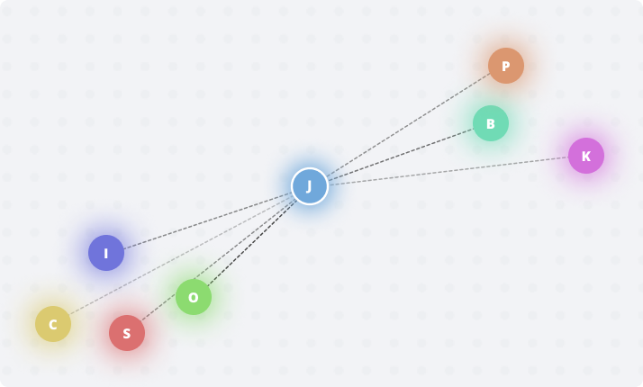

# Proximity Voice Chat

A voice communication platform where distance determines the loudness of incoming connections. 

Live Preview: <https://proximity-voice-chat.vojtechlousa.repl.co>


---

## Usage

Clone this repo, then install everything else using NPM:
```bash
npm i 
```

Start with
```
npm run start
```

## Ideas for the future
* Add a minimap showing all connected participants
* Add multiple rooms
* Add mobile support
* Add a glow around people representing their current volume


## License
[MIT](https://choosealicense.com/licenses/mit/)
